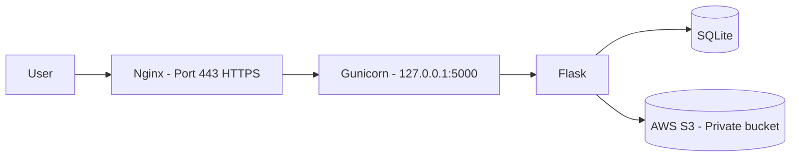
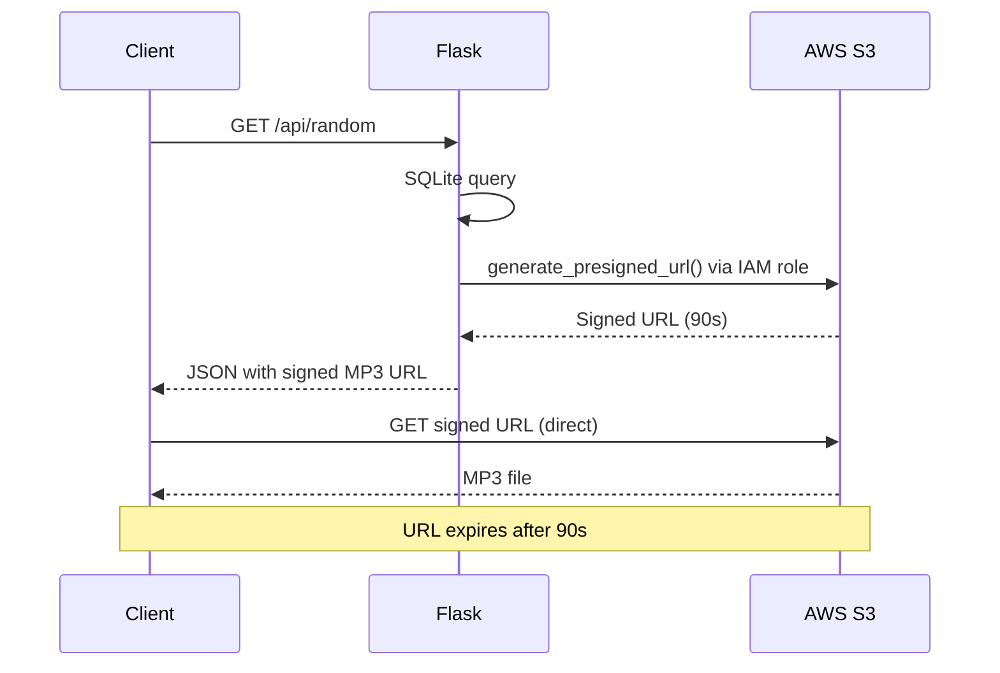
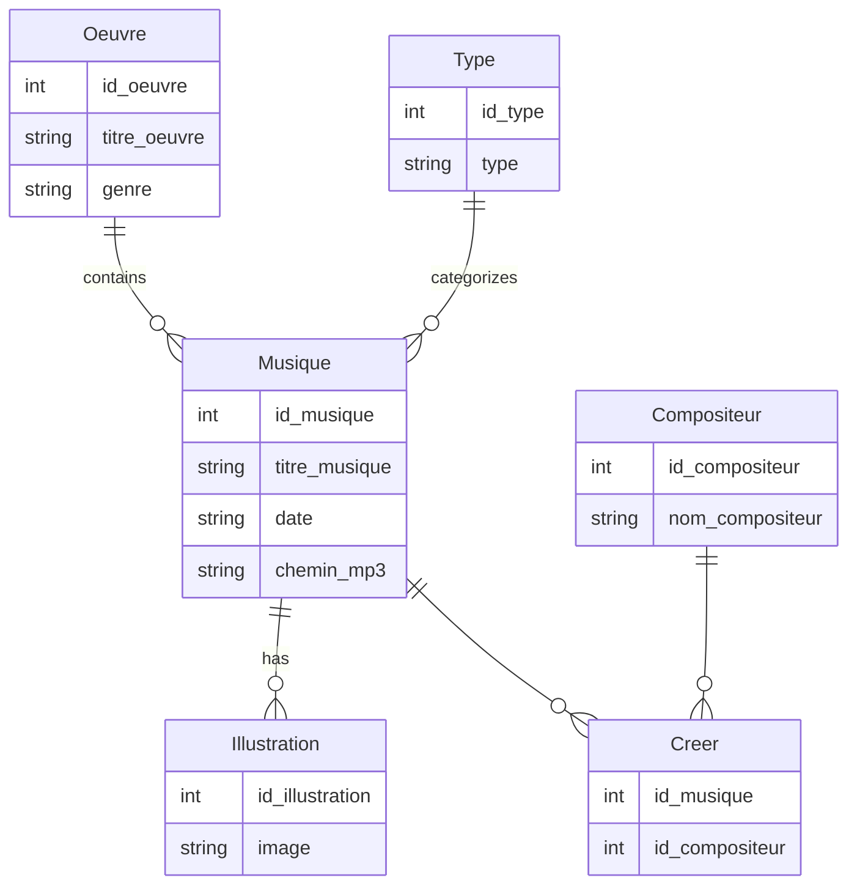

# ishtar_sound


Music blindtest web app focused on anime and video game soundtracks. Built with Flask and deployed on AWS. Players have 25 seconds to guess the track - by title, work, or artist.

---

## Overview



### Pre-signed URL flow



### Database schema



### Project structure

```
ishtar_sound/
├── app.py              - Flask entry point
├── config.py           - Config + S3 client + presign_url()
├── database.py         - SQLite connection
├── routes/
│   ├── blindtest.py    - Public routes and API
│   └── admin.py        - Admin routes
├── templates/
│   ├── index.html
│   ├── blindtest.html
│   └── bibliotheque.html
├── static/
│   └── css/style.css
└── requirements.txt
```

---

## Usage

### Prerequisites

- Python 3
- An AWS account with an S3 bucket and an EC2 IAM role

### Run locally

```bash
# Install dependencies
pip install -r requirements.txt

# Copy and fill the environment file
cp .env-exemple .env

# Run
python app.py
```

---

## Specificities

### Features

- 25-second timer per track
- Filters by type (Opening, Ending, OST, Game)
- Flexible answer check - title, work, or artist accepted
- Music library with on-demand playback
- Admin API secured by token

### Security

- **Private S3 bucket** - no file is directly accessible, no cost exploit risk
- **Pre-signed URLs** - Flask generates temporary S3 URLs (60-90 seconds) per request via boto3
- **EC2 IAM role** - no AWS access keys in code or environment variables
- **Parameterized queries** - SQL injection protection
- **Rate limiting** - Flask-Limiter on all public routes (200 req/hour)
- **HTTPS** - Let's Encrypt certificate with automatic renewal

### Public API

| Method | Route | Description |
|---|---|---|
| GET | `/` | Home page |
| GET | `/blindtest` | Game page |
| GET | `/api/random?type_id=X` | Random track with pre-signed URL |
| POST | `/api/check` | Answer check |
| GET | `/api/play/<id>` | Pre-signed URL for library playback |
| GET | `/bibliotheque` | Music library |

### Admin API

All `/admin/*` routes require the `X-Admin-Token` header.

| Method | Route | Description |
|---|---|---|
| POST | `/admin/oeuvre` | Add a work |
| POST | `/admin/compositeur` | Add a composer |
| POST | `/admin/musique` | Add a track |
| POST | `/admin/creer` | Link track to composer |
| POST | `/admin/illustration` | Add an illustration |
| GET | `/admin/musiques` | List all tracks |

### Environment variables

```
SECRET_KEY=
ADMIN_TOKEN=
DB_PATH=ishtar.db
S3_BUCKET=
S3_REGION=eu-west-3
DEBUG=false
```

### AWS deployment

MP3 files and illustrations are hosted on a **private S3 bucket**. Full URLs are stored in the database. Flask generates temporary pre-signed URLs per request via boto3 - files are never exposed directly.

The EC2 instance accesses S3 through an **IAM role** attached to the instance, no access keys involved.

HTTPS is handled by **Nginx** with a **Certbot** certificate on `ishtar-sound.fr`, auto-renewed every 90 days.

### Stack

| Layer | Technology |
|---|---|
| Backend | Python 3 / Flask |
| Frontend | HTML / CSS / Vanilla JS |
| Database | SQLite |
| Server | Gunicorn + Nginx |
| File storage | AWS S3 (private bucket) |
| Hosting | AWS EC2 (t3.micro) |

---

## License

MIT