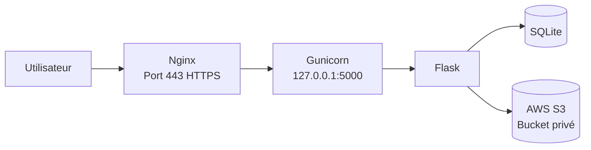
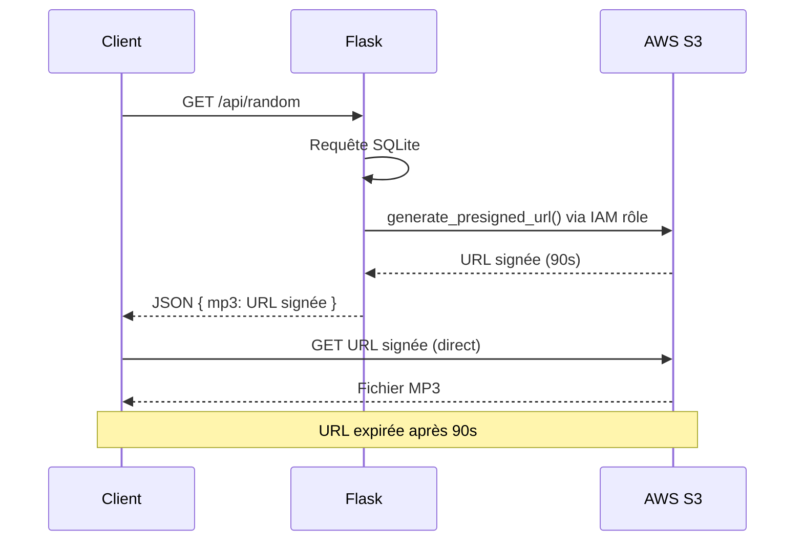

# Ishtar Sound — Blindtest musical

Application web de blindtest musical orientée anime et jeux vidéo, développée avec Flask et déployée sur AWS.

## Stack technique

- **Backend** : Python 3 / Flask
- **Frontend** : HTML / CSS / JS vanilla
- **Base de données** : SQLite
- **Serveur** : Gunicorn + Nginx
- **Stockage fichiers** : AWS S3 (bucket privé)
- **Hébergement** : AWS EC2 (t3.micro)

## Fonctionnalités

- Blindtest avec timer de 25 secondes
- Filtres par type (Opening, Ending, OST, Jeu)
- Vérification de réponse flexible (titre, oeuvre ou artiste)
- Bibliothèque des musiques disponibles avec lecture à la demande
- API d'administration sécurisée par token

## Sécurité

- **Bucket S3 privé** : aucun fichier accessible directement, pas de risque de cost exploit
- **Pre-signed URLs** : Flask génère des URLs S3 temporaires (60–90 secondes) à chaque requête via boto3
- **IAM rôle EC2** : pas de clés d'accès AWS dans le code ou les variables d'environnement
- **Requêtes paramétrées** : protection contre les injections SQL
- **Rate limiting** : Flask-Limiter sur toutes les routes publiques
- **HTTPS** : certificat Let's Encrypt avec renouvellement automatique

## Architecture

### Infrastructure



### Flux pre-signed URL



### Schéma BDD


## Structure

```
ishtar_sound/
├── app.py              # Point d'entrée Flask
├── config.py           # Configuration + client S3 + presign_url()
├── database.py         # Connexion SQLite
├── routes/
│   ├── blindtest.py    # Routes publiques + API
│   └── admin.py        # Routes d'administration
├── templates/
│   ├── index.html
│   ├── blindtest.html
│   └── bibliotheque.html
├── static/
│   └── css/style.css
└── requirements.txt
```

## API publique

| Méthode | Route | Description |
|---------|-------|-------------|
| GET | `/` | Page d'accueil |
| GET | `/blindtest` | Page de jeu |
| GET | `/api/random?type_id=X` | Musique aléatoire (pre-signed URL incluse) |
| POST | `/api/check` | Vérification de réponse |
| GET | `/api/play/<id>` | Pre-signed URL pour lecture en bibliothèque |
| GET | `/bibliotheque` | Bibliothèque des musiques |

## API d'administration

Toutes les routes `/admin/*` nécessitent le header `X-Admin-Token`.

| Méthode | Route | Description |
|---------|-------|-------------|
| POST | `/admin/oeuvre` | Ajouter une oeuvre |
| POST | `/admin/compositeur` | Ajouter un compositeur |
| POST | `/admin/musique` | Ajouter une musique |
| POST | `/admin/creer` | Lier musique ↔ compositeur |
| POST | `/admin/illustration` | Ajouter une illustration |
| GET | `/admin/musiques` | Lister toutes les musiques |


## Déploiement AWS

### S3

Les fichiers MP3 et illustrations sont hébergés sur un bucket S3 **privé**. Les URLs complètes sont stockées en base (`chemin_mp3`, `image`). Flask génère des pre-signed URLs temporaires à chaque requête via boto3 — les fichiers ne sont jamais exposés directement.

L'EC2 accède à S3 via un **rôle IAM** attaché à l'instance (pas de clés d'accès).

### HTTPS

Le domaine `ishtar-sound.fr` est enregistré sur OVH. Deux enregistrements DNS de type **A** pointent vers l'IP publique de l'EC2 :

| Entrée | Cible |
|---|---|
| `ishtar-sound.fr` | IP publique EC2 |
| `www.ishtar-sound.fr` | IP publique EC2 |

Certificat SSL généré via **Certbot** :

```bash
sudo apt install certbot python3-certbot-nginx
sudo certbot --nginx -d ishtar-sound.fr -d www.ishtar-sound.fr
```

Renouvellement automatique (validité de 90 jours).

### Configuration Nginx

```nginx
server {
    listen 443 ssl;
    server_name ishtar-sound.fr www.ishtar-sound.fr;

    ssl_certificate /etc/letsencrypt/live/ishtar-sound.fr/fullchain.pem;
    ssl_certificate_key /etc/letsencrypt/live/ishtar-sound.fr/privkey.pem;

    location / {
        proxy_pass http://127.0.0.1:5000;
        proxy_set_header Host $host;
        proxy_set_header X-Real-IP $remote_addr;
    }
}

server {
    listen 80;
    server_name ishtar-sound.fr www.ishtar-sound.fr;
    return 301 https://$host$request_uri;
}
```

## Variables d'environnement

Un fichier `.env` chiffré et secret contient mes valeurs importantes :

```
SECRET_KEY=
ADMIN_TOKEN=
DB_PATH=ishtar.db
S3_BUCKET=
S3_REGION=eu-west-3
DEBUG=false
```

## Versions

### v1.0
- 27 sons répartis par type (Opening, Ending, OST, Jeu)
- Extrait audio de 25 secondes
- Bucket S3 privé avec pre-signed URLs
- Rate limiting 200 req/heure
